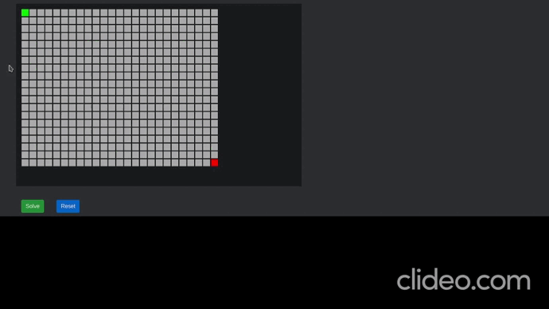

# MAZE SOLVER
You can make your own grids and have it solved by various path-finding algorithms to see the shortest path from source to destination!

Check it out [here](https://sleepturtle-maze-solver.herokuapp.com/)

This mini-projcet is built entirely using only Vanilla JavaScript!

Here's a short demo!

